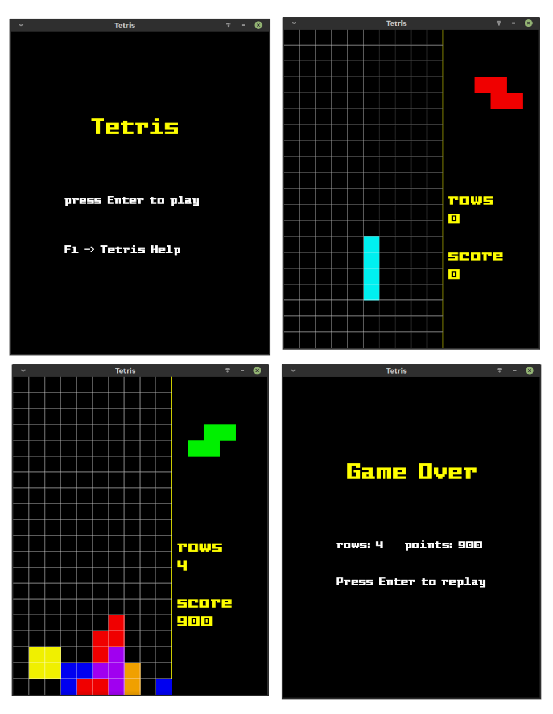
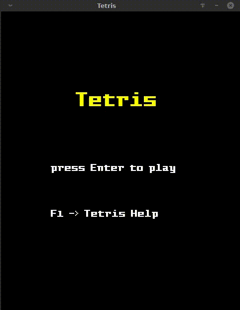

# Tetris - by Anand Mohan

# Screenshots

# How to Run
### For Windows
get the latest release from [github releases](https://github.com/andmhn/tetris/releases)

download the windows release and extract it

now run tetris from inside the folder

### For Linux
install sfml library from your package repository

get the latest release from [github releases](https://github.com/andmhn/tetris/releases) 

download the linux release

# Building from source

## For Linux 

you need to have sfml dependency installed on system

now run make command in project root directory

the executables are in exe directory

## For windows :

you only need to install msvc compiler first

make sure you can run cl.exe from terminal or add it to path environment variable

the double click the "build_msvc.bat" file in root directory or you can run it from command prompt

the executables are in exe directory
